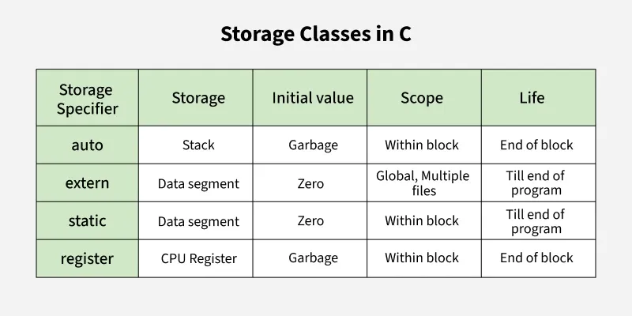

# Storage Class in C

This note clarifies the frequently confused concepts around **storage classes** in C: `auto`, `static`, `extern`, and `register`.

## References
- [Storage Classes in C](https://www.geeksforgeeks.org/c/storage-classes-in-c/)

## 1) auto
- **Definition**: This is the default storage class for all the variables declared inside a function or a block. Auto variables can be only accessed within the block/function they have been declared and not outside them (which defines their scope).
- **Properties of auto Variables**: 
    - Scope: Local
    - Default Value: Garbage Value
    - Memory Location: RAM
    - Lifetime: Till the end of its scope
- **Example**: 
```c
#include <stdio.h>
int main() {
    // auto is optional here, as it's the default storage class
    auto int x = 10;  
    printf("%d", x);
    return 0;
}
```
```c
// Output: 
10
```
- **Explanation**: The auto keyword is used to declare a local variable with automatic storage. However, in C, local variables are automatically auto by default, so specifying auto is optional. Auto keyword is not used in front of functions as functions are not limited to block scope.

## 2) static
- **Definition**: This storage class is used to declare static variables that have the property of preserving their value even after they are out of their scope! Hence, static variables preserve the value of their last use in their scope.
- **Properties of auto Variables**: 
    - Scope: Local
    - Default Value: Zero
    - Memory Location: RAM
    - Lifetime: Till the end of the program
- **Example**: 
```c
#include <stdio.h>
void counter() {
    // Static variable retains value between calls
    static int count = 0;  
    count++;
    printf("Count = %d\n", count);
}
int main() {
    // Prints: Count = 1
    counter();  
  
    // Prints: Count = 2
    counter(); 
    return 0;
}
```
```c
// Output:
Count = 1
Count = 2
```
- **Explanation**: The static variable count retains its value between function calls. Unlike local variables, which are reinitialized each time the function is called, static variables remember their previous value.

## 3) extern
- **Definition**: 
    - Extern storage class simply tells us that the variable is defined elsewhere and not within the same block where it is used. Basically, the value is assigned to it in a different block and this can be overwritten/changed in a different block as well.
    - Also, a normal global variable can be made extern as well by placing the 'extern' keyword before its declaration/definition in any function/block.
- **Properties of auto Variables**: 
    - Scope: Global
    - Default Value: Zero
    - Memory Location: RAM
    - Lifetime: Till the end of the program.
- **Example**: 
- The below file contains a global variable.
    
**printVar.c**
```c
// Global variable declaration
int globalVar;
```
- Another file declares this variable as extern static that it is declared in another file. It then prints this variable.

**main.c**
```c
#include <stdio.h>

// Global variable
int globalVar = 100;  

void printGlobalVar();

int main() {
  
    // Prints: Global variable is: 100
    printGlobalVar(); 
    return 0;
}
```
- To run this program, we have to compile both of the files together so that main.c can get the definition of the variable globalVar. We use the following command for GCC:
```bash
    gcc main.c printVar.c -o main
```

## 4) register
- **Definition**: This storage class declares register variables that have the same functionality as that of the auto variables. The only difference is that the compiler tries to store these variables in the register of the microprocessor if a free register is available making it much faster than any of the other variables.
- **Properties of auto Variables**: 
    - Scope: Local
    - Default Value: Garbage Value
    - Memory Location: Register in CPU or RAM
    - Lifetime: Till the end of its scope
> *Note:* The compiler may ignore the suggestion based on available registers.

- **Example**: 
```c
#include <stdio.h>

int main() {
  
    // Suggest to store in a register
    register int i;  
    for (i = 0; i < 5; i++) {
        printf("%d ", i);
    }
    return 0;
}
```
```c
// Output:
0 1 2 3 4 
```
- **Explanation**: The register keyword suggests storing the variable in a register for faster access, but the compiler may not always honor this request based on available CPU registers.

## **Summary**
- The below table summarize the above storage classes:


