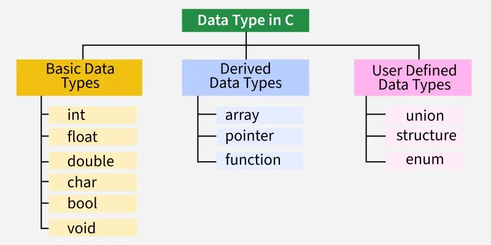

# Data Types in C (Focus on Derived Data Types & User Defined Data Types)

## Table of Contents
- [1. Derived Data Types In C](#1-derived-data-types-in-c)
    - [Array](#array)
    - [Pointer](#pointer)
    - [Function](#function)
- [2. User-Defined Data Types In C](#2-user-defined-data-types-in-c)
    - [Structure](#struct)
    - [Union](#union)
    - [Enum](#enum)
    - [Typedef](#typedef)
- [3. Q&A (Bản Dịch)](#3-qa-bản-dịch)
  - [1. Khác nhau giữa struct và array?](#1-khác-nhau-giữa-struct-và-array)
  - [2. Kích thước struct được tính như thế nào?](#2-kích-thước-struct-được-tính-như-thế-nào)
  - [3. Căn chỉnh bộ nhớ trong struct hoạt động như thế nào?](#3-căn-chỉnh-bộ-nhớ-trong-struct-hoạt-động-như-thế-nào)
  - [4. Padding là gì trong struct? Làm sao tránh padding?](#4-padding-là-gì-trong-struct-làm-sao-tránh-padding)
  - [5. Có thể gán trực tiếp giữa 2 struct cùng kiểu không?](#5-có-thể-gán-trực-tiếp-giữa-2-struct-cùng-kiểu-không)
  - [6. Struct có thể so sánh bằng toán tử == không?](#6-struct-có-thể-so-sánh-bằng-toán-tử--không)
  - [7. Struct có thể dùng làm tham số hàm không?](#7-struct-có-thể-dùng-làm-tham-số-hàm-không)
  - [8. #pragma pack(1) có ý nghĩa gì?](#8-pragma-pack1-có-ý-nghĩa-gì)
  - [9. Truyền struct giữa các MCU có thể sai do padding không?](#9-truyền-struct-giữa-các-mcu-có-thể-sai-do-padding-không)
  - [10. Union là gì?](#10-union-là-gì)
  - [11. Kích thước của union là bao nhiêu?](#11-kích-thước-của-union-là-bao-nhiêu)
  - [12. Union dùng khi nào?](#12-union-dùng-khi-nào)
  - [13. Ghi vào một thành viên union rồi đọc thành viên khác thì sao?](#13-ghi-vào-một-thành-viên-union-rồi-đọc-thành-viên-khác-thì-sao)
  - [14. Có thể khởi tạo nhiều thành viên của union cùng lúc không?](#14-có-thể-khởi-tạo-nhiều-thành-viên-của-union-cùng-lúc-không)
  - [15. Union có thể chứa struct không?](#15-union-có-thể-chứa-struct-không)
  - [16. Union thường dùng trong embedded để làm gì?](#16-union-thường-dùng-trong-embedded-để-làm-gì)
  - [17. Enum là gì?](#17-enum-là-gì)
  - [18. Mặc định giá trị đầu tiên của enum là gì?](#18-mặc-định-giá-trị-đầu-tiên-của-enum-là-gì)
  - [19. Enum có thể gán giá trị cụ thể cho phần tử không?](#19-enum-có-thể-gán-giá-trị-cụ-thể-cho-phần-tử-không)
  - [20. Giá trị của phần tử tiếp theo nếu không chỉ định?](#20-giá-trị-của-phần-tử-tiếp-theo-nếu-không-chỉ-định)
  - [21. Tại sao nên dùng enum thay vì #define?](#21-tại-sao-nên-dùng-enum-thay-vì-define)
  - [22. Enum có thể âm không?](#22-enum-có-thể-âm-không)
  - [Mẹo thực hành nhanh](#mẹo-thực-hành-nhanh)


## References
- [Data Types in C](https://www.geeksforgeeks.org/c/data-types-in-c/)
- [Derived Data Types in C](https://www.geeksforgeeks.org/c/c-derived-data-types/)
- [User-Defined Data Types In C](https://www.geeksforgeeks.org/cpp/c-user-defined-data-types/)

Each variable in C has an associated data type (kiểu dữ liệu liên kết). It specifies the type of data that the variable can store like integer, character, floating, double, etc.

C is a statically (*cố định*) type language where each variable's type must be specified at the declaration and once specified, it cannot be changed.



>*Derived Data Types (Kiểu dữ liệu phát sinh) là các dữ liệu được tạo ra từ các dữ liệu cơ bản như int, char, float, double. Các kiểu dữ liệu này bao gồm **array**, **pointer**, **function**.*

>*User-Defined Data Types là các kiểu dữ liệu do người dùng tự định nghĩa để nhóm các biến thuộc các kiểu dữ liệu khác nhau vào một khối thống nhất, giúp quản lý dữ liệu phức tạp dễ dàng hơn thay vì sử dụng nhiều biến riêng lẻ. Các kiểu dữ liệu này bao gồm **struct**, **union**, **enum**, **typedef**.*

## 1. Derived Data Types In C
- ### Array:
    - Definition:
        - Array in C is a fixed-size collection of similar data items stored in contiguous (*kề nhau*) memory locations. An array is capable of storing the collection of data of primitive (int, float,...), derived (other arrays,...), and user-defined data types (struct, ...).

    - Array Declaration:
        ```c
            data_type array_name [size];
        ```

    - Example:
        ```c
        // C program to illustrate (minh họa) derived data type - Array
        #include <stdio.h>

        int main()
        {
            // declaring the size of the array
            int N = 3;

            // declaring array of type int of size N
            int arrI[] = { 18, 36, 54 };
            for (int i = 0; i < N; i++)
                printf("%d ", arrI[i]);

            printf("\n");

            // declaring array of type double of size N
            double arrD[] = { 3.14, 6.28, 9.42 };
            for (int i = 0; i < N; i++)
                printf("%lf ", arrD[i]);

            return 0;
        }
        ```
        ```c
        Output:
            18 36 54 
            3.140000 6.280000 9.420000 
        ```

    - Properties of Arrays in C:
        - Array in C has a fixed size that should be known at compile time.
        - An array can only store elements of the same type.
        - Elements of the array are stored in the contiguous memory location.
        - Array provides random access to its elements.
        - An array can have multiple dimensions i.e. directions in which it can grow.

- ### Pointer:
    - Definition: 
        - A pointer in C language is a data type that stores the address where data is stored. Pointers store memory addresses of variables, functions, and even other pointers.
    
    - Pointer Declaration:
        ```c
            data_type * ptr_name;   // *: dereferencing operator.
        ```
    
    - Example:
        ```c
        // C program to illustrate derived datatype - pointers
        #include <stdio.h>

        int main()
        {
            int var = 20;

            // declare pointer variable
            int* myPtr;

            // note that data type of ptr and var must be same

            // assign the address of a variable to a pointer
            myPtr = &var;

            // printing myPtr to show value stored in myPtr which is
            // address of var
            printf("Value at myPtr = %p \n", myPtr);

            // printing var variable directly
            printf("Value at var = %d \n", var);

            // using dereferencing operator to get the value myPtr
            // is pointing at
            printf("Value at *myPtr = %d \n", *myPtr);

            return 0;
        }
        ```
        ```c
        Output:
            Value at myPtr = 0x7ffd0850df9c 
            Value at var = 20 
            Value at *myPtr = 20 
        ```
    - Properties of Pointers in C:
        - A pointer can be of any type such as an integer pointer, function pointer, etc.
        - A pointer can be any level deep such as a double pointer(pointer to pointer), triple pointer, etc.
        - All types of pointers have the same size on the given platform.
        - Pointers may be of different sizes on different platforms.

- ### Function:
    - Definition:
        - A function is called a C language construct which consists of a function-body associated with a function-name. In every program in C language, execution begins from the main function, which gets terminated after completing some operations which may include invoking other functions.

    - Function Declaration:
        ```c
            return_type function_name(data_type param1, data_type param2, ...);
        ```

    - Example:
        ```c
        // C program to illustrate derived data type - function
        #include <stdio.h>

        int multiply(int param1, int param2)
        {
            // return statement which return type int
            return (param1 * param2);
        }

        int main()
        {
            // declaring parameters to be passed to the function
            int param1 = 5, param2 = 3;

            // calling the function and storing the return value in
            // result
            int result = multiply(param1, param2);

            // printing the result to the console
            printf("%d", result);
            return 0;
        }
        ```
        ```c
        Output:
            15
        ```
    - Components of a Function in C:
        - Return Type: Specifies the type of the value that the function will return after its execution.
        - Function Name: It is a unique name that identifies a function. Using this unique name, a function is called from various parts of a program.
        - Function Body: A function's body consists of the statements that define what the function actually does. All the operations including the return of the result are done inside the body of a function.
        - Parameters: Parameters are the input values passed to the function by the caller. A function can have none or multiple parameters.
        - Return Statement: A function returns a value depending on its return type.

## 2. User-Defined Data Types In C
- ### Structure:
    - Definition:
        - C doesn't have built-in object-oriented features like C++ but structures can be used to achieve (*tính đóng gói*) to some level. Structures are used to group items of different types into a single type. The "struct" keyword is used to define a structure. The size of the structure is equal to or greater than the total size of all of its members.

        - Syntax:
            ```c
            struct structure_name {
                data_type member_name1;
                data_type member_name1;
                ....
                ....
            };
            ```
        
        - Example:
            ```c
            #include <stdio.h>

            // Defining a structure
            struct Person {
                char name[50];
                int age;
            };

            int main()
            {
                // Declaring a variable of the structure type
                struct Person person1;

                // Initializing structure members
                strcpy(person1.name, "NgVanA");
                person1.age = 25;

                // Accessing and printing structure members
                printf("Name: %s\n", person1.name);
                printf("Age: %d\n", person1.age);
                return 0;
            }
            ```
            ```c
            Output:
                Name: NgVanA
                Age: 25
            ```
- ### Union:
    - Definition:
        - Unions are similar to structures in many ways. What makes a union different is that all the members in the union are stored in the same memory location resulting in only one member containing data at the same time. The size of the union is the size of its largest member. Union is declared using the "union" keyword.

        - Syntax:
            ```c
            union union_name {
                datatype member1;
                datatype member2;
                ...
            };
            ```
        
        - Example:
            ```c
            #include <stdio.h>

            // Declaring a union
            union Data {
                int i;
                float f;
                char str[20];
            };

            int main()
            {
                // creating an instance named 'data' of union Data
                union Data data;
                data.i = 10;
                printf("Data.i: %d\n", data.i);

                data.f = 3.14;
                printf("Data.f: %f\n", data.f);

                strcpy(data.str, "Hello, World");
                printf("Data.str: %s\n", data.str);
                return 0;
            }
            ```
            ```c
            Output:
                Data.i: 10
                Data.f: 3.140000
                Data.str: Hello, World
            ```
- ### Enum:
    - Definition:
        - Enum is short for "Enumeration". It allows the user to create custom data types with a set of named integer constants. The "enum" keyword is used to declare an enumeration. Enum simplifies and makes the program more readable.

    - Syntax:
        ```c
            enum enum_name {const1, const2, ..., constN};
        ```
        - Here, the const 1 will be assigned 0, const2 = 1, and so on in the sequence.
        - We can also assign a custom integer value such as:
        ```c
            enum enum_name {
                const1 = 8;
                const2 = 4;
            }
        ```

    - Example:
        ```c
        #include <stdio.h>

        // Declaring a enum
        enum _days_ {
            Monday = 2,
            Tuesday,
            Wednesday,
            Thursday,
            Friday,
            Saturday,
            Sunday
        };

        int main()
        {
            enum _days_ today = Friday;
            printf("Today is %d\n", today);
            return 0;
        }
        ```
        ```c
        Output:
            Today is 6
        ```
- ### Typedef:
    - Definition:
        - typedef is used to redefine the existing data type names. Basically, it is used to provide new names to the existing data types. The "typedef" keyword is used for this purpose;
    
    - Syntax:
        ```c
            typedef existing_name alias_name;
        ```
    
    - Example:
        ```c
        #include <stdio.h>

        typedef char character;

        int main()
        {
            character* name = "HieuDo";
            printf("Say hi to %s \n", name);
            return 0;
        }
        ```
        ```c
        Output:
            Say hi to HieuDo
        ```
## 3. Q&A (Bản Dịch)
### 1. Khác nhau giữa struct và array?
- **Array**: chứa **các phần tử cùng một kiểu** (liền kề trong bộ nhớ).  
  ```c
  int a[3] = {1,2,3}; // 3 int, cùng kiểu
  ```
- **struct**: nhóm **nhiều biến có thể khác kiểu** thành một khối logic.
  ```c
  struct Point { int x; float y; char tag; };
  ```
- **Dùng khi nào?**  
    - Dữ liệu đồng nhất => *array*.  
    - Dữ liệu thuộc về "một thực thể" nhưng khác kiểu => *struct*.

### 2. Kích thước struct được tính như thế nào?
- Tổng kích thước các thành viên **cộng** thêm **padding** (để thỏa điều kiện căn chỉnh – alignment). Vì vậy `sizeof(struct)` có thể **lớn hơn** tổng `sizeof` từng trường.
    ```c
    struct S { 
        char c; 
        int i; 
    }; 
    // thường sizeof(S) = 8 (1 byte c + 3 byte padding + 4 byte i)
    ```

### 3. Căn chỉnh bộ nhớ trong struct hoạt động như thế nào?
- Mỗi kiểu dữ liệu có **yêu cầu căn chỉnh tự nhiên** (natural alignment), ví dụ `int` thường cần địa chỉ chia hết cho 4. Trình biên dịch:
    - Sắp xếp từng trường tại một **offset** đáp ứng căn chỉnh của chính nó.  
    - Có thể **chèn byte trống (padding)** giữa các trường.  
    - Tổng kích thước struct thường được làm tròn đến **bội số căn chỉnh lớn nhất** của các trường.

    >**Mẹo giảm padding:** đặt các trường **từ lớn => nhỏ**, gom các trường cùng căn chỉnh lại với nhau.

### 4. Padding là gì trong struct? Làm sao tránh padding?
- **Padding** = các **byte trống** chèn vào để đảm bảo mỗi trường bắt đầu ở địa chỉ phù hợp với **alignment**.  
- **Cách giảm:**
  - **Sắp xếp lại thứ tự trường** (từ kiểu lớn => nhỏ).  
  - Dùng **`#pragma pack(1)`** hoặc **`__attribute__((packed))`** để “nén” (xem mục 47).

    >**LƯU Ý:** ép pack có thể gây **truy cập không căn chỉnh** => giảm hiệu năng hoặc lỗi bus trên một số MCU.

### 5. Có thể gán trực tiếp giữa 2 struct cùng kiểu không?
- **CÓ**, trong C: phép gán sẽ **copy toàn bộ byte** của struct nguồn sang struct đích.
    ```c
    struct S { int x; char c; };
    struct S a = {1,'A'}, b;
    b = a; // hợp lệ, copy toàn bộ
    ```

### 6. Struct có thể so sánh bằng toán tử `==` không?
- **KHÔNG**, trong C phải **so sánh từng trường** hoặc dùng `memcmp()` (chỉ an toàn khi hai struct **cùng kiểu** và **không chứa padding "rác"** chưa khởi tạo).
    ```c
    bool equal = (s1.x == s2.x) && (s1.c == s2.c);
    ```

### 7. Struct có thể dùng làm tham số hàm không?
- **CÓ**, nhưng trong embedded thường **truyền con trỏ** để:
    - Tránh copy struct lớn (tiết kiệm thời gian/bộ nhớ stack),
    - Cho phép hàm **sửa** dữ liệu gốc.
    ```c
    void foo(struct S *p) { p->x = 42; }
    ```

### 8. `#pragma pack(1)` có ý nghĩa gì?
- Yêu cầu trình biên dịch **giảm căn chỉnh** của các trường xuống **1 byte** (tức là **không chèn padding**). Tương tự trên GCC/Clang có `__attribute__((packed))`.

    - **ƯU ĐIỂM:** layout “chặt”, hữu ích khi **serialize/deserialize** dữ liệu đúng từng byte theo **protocol**.  
    - **NHƯỢC ĐIỂM:** 
        - Truy cập không căn chỉnh => **tốc độ chậm**, thậm chí **fault** trên một số CPU.  
        - Giảm tính **portability** (layout phụ thuộc compiler).  
        => **Khuyến nghị:** Chỉ pack **struct trao đổi dữ liệu** (I/O, network, file), còn struct tính toán nội bộ thì **không pack**.

### 9. Truyền struct giữa các MCU có thể sai do padding không?
- **CÓ**, Rủi ro đến từ:
    - **Padding/packing** khác nhau giữa toolchain,  
    - **Endian** khác nhau (cách sắp xếp các byte của 1 chuỗi dữ liệu nhiều byte trong bộ nhớ máy tính, gồm Litte Endian và Big Endian)

        ```c
        - Little Endian: byte có trọng số thấp nhất ở địa chỉ bộ nhớ thấp nhất. 
        - Big Endian: byte có trọng số cao nhất ở địa chỉ bộ nhớ thấp nhất. 
        ```
    - **Kích thước kiểu** khác nhau (ví dụ `long` 32/64 bit),  
    - **Bit-field layout** khác.

- **Cách an toàn:**
    - Dùng **`__attribute__((packed))` / `#pragma pack(1)`** cho frame truyền **và** định nghĩa chung hai bên.  
    - Hoặc tốt nhất: **serialize thủ công** từng byte (shift & mask) để **không phụ thuộc** layout struct.

### 10. Union là gì?
- Kiểu đặc biệt mà **các thành viên chia sẻ cùng một vùng nhớ**. Tại một thời điểm **chỉ hợp lệ một thành viên**.
    ```c
    union U {
    uint32_t u32;
    float    f32;
    uint8_t  b[4];
    };
    ```
- Dùng để **diễn giải lại** cùng dữ liệu theo nhiều cách.

### 11. Kích thước của union là bao nhiêu?
- Bằng **kích thước thành viên lớn nhất**, và alignment của union là **alignment lớn nhất** trong các thành viên.

### 12. Union dùng khi nào?
- Khi dữ liệu **cùng chỗ nhớ** nhưng **biểu diễn khác nhau** ở các thời điểm khác nhau, hoặc khi cần “nhìn” **nhiều góc** của cùng bit/byte (ví dụ parse frame, overlay register).

### 13. Ghi vào một thành viên union rồi đọc thành viên khác thì sao?
- Về tiêu chuẩn C, đó là **undefined behavior** (UB), **trừ** một số ngoại lệ:
    - Đọc lại bằng **mảng `unsigned char`/`std::byte`/`uint8_t`** để xem **biểu diễn thô** là hợp lệ.  
    - Một số compiler cho phép "type punning" qua union như **extension**, nhưng không portable.  
- **An toàn nhất:** dùng `memcpy()` để chuyển **bit-pattern** giữa kiểu khác nhau.

### 14. Có thể khởi tạo nhiều thành viên của union cùng lúc không?
- **KHÔNG.** Tại một thời điểm chỉ có **một** thành viên có giá trị hợp lệ. Khởi tạo/ghi thành viên này sẽ **ghi đè** dữ liệu của thành viên khác.

### 15. Union có thể chứa struct không?
- **CÓ**, và ngược lại **struct cũng có thể chứa union**. Đây là cách mạnh để **map bit/byte**:
    ```c
    typedef union {
        struct { uint8_t lo, hi; };
        uint16_t word;
    } U16;
    ```

### 16. Union thường dùng trong embedded để làm gì?
- **Map thanh ghi**: xem một register vừa ở dạng **word** vừa **byte/bit** (kèm `volatile`).  
- **Parse protocol**: đọc frame vào mảng byte rồi diễn giải thành các trường.  
- **Tiết kiệm RAM**: nhiều dạng dữ liệu **không dùng đồng thời**.
    > Lưu ý: mapping bit-field phụ thuộc **endianness** và **ABI**, cần cẩn trọng.

### 17. Enum là gì?
- Kiểu liệt kê cho **các hằng số nguyên có tên**, giúp code **dễ đọc** và **được compiler kiểm tra**.
    ```c
    typedef enum { MODE_IDLE, MODE_RUN, MODE_ERR } Mode_t;
    ```

### 18. Mặc định giá trị đầu tiên của enum là gì?
- **0** (nếu không gán khác).
    ```c
    enum E { A, B, C }; // A = 0, B = 1, C = 2
    ```

### 19. Enum có thể gán giá trị cụ thể cho phần tử không?
- **CÓ.**
    ```c
    enum E { A = 10, B = 20, C = 25 };
    ```

### 20. Giá trị của phần tử tiếp theo nếu không chỉ định?
- Sẽ **tự tăng 1** từ giá trị trước đó.
    ```c
    enum E { A = 10, B, C }; // A = 10, B = 11, C = 12
    ```

### 21. Tại sao nên dùng enum thay vì `#define`?
- **Dễ debug**: tên enum hiện rõ trong debugger.  
- **Phạm vi & kiểu**: có **type** (đặc biệt trong C++/C11 `enum` scoped), tránh đụng tên toàn cục của `#define`.  
- **Compiler check**: có thể **cảnh báo** khi gán sai hoặc thiếu case trong `switch`.  
- **Tự tài liệu hóa**: ý nghĩa rõ ràng hơn số “magic”.

### 22. Enum có thể âm không?
- **CÓ.** Enum dùng kiểu nguyên có dấu (thường là `int`), nên có thể gán giá trị âm.
    ```c
    enum Error { OK = 0, E_TIMEOUT = -1, E_IO = -2 };
    ```

## Mẹo thực hành nhanh
- **Giảm padding**: sắp xếp trường *từ lớn => nhỏ*, chỉ pack khi **thực sự cần** trao đổi dữ liệu nhị phân.  
- **Giao tiếp giữa MCU/PC**: tránh gửi **raw struct**, hãy **serialize** (shift/mask, endian rõ ràng).  
- **Union & UB**: muốn đọc bit-pattern => dùng `memcpy()` hoặc truy cập qua `uint8_t[]`.  
- **Enum trong API**: luôn dùng enum cho **mode/state/error code**, `switch` bao hết các case để compiler nhắc lỗi thiếu.